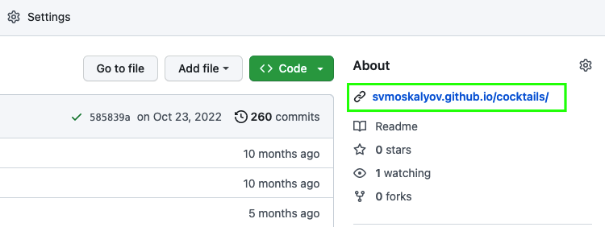

# COCKTAILS

View the page by following the link in the section `About`

## If cloned, it is necessary for the project to work

1. Make sure you have an LTS version of Node.js installed on your computer.
   [Download and install](https://nodejs.org/en/) if needed.
2. Install the basic project dependencies with the `npm install` command.
3. Start development mode by running the `npm start` command.
4. Go to [http://localhost:3000](http://localhost:3000) in your browser. This
   page will automatically reload after saving changes to project files.
